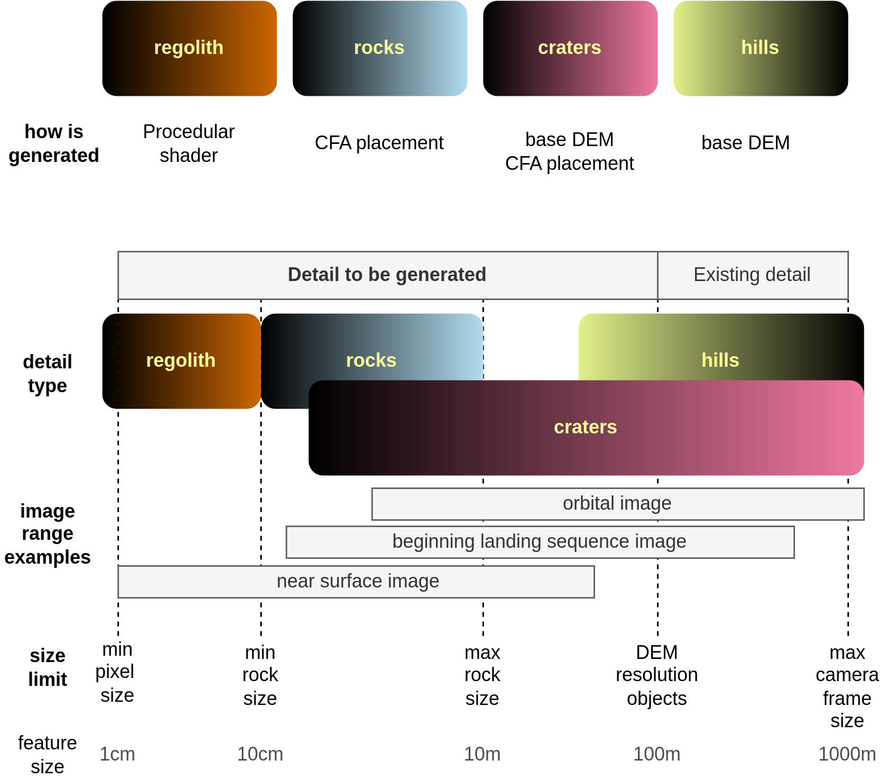
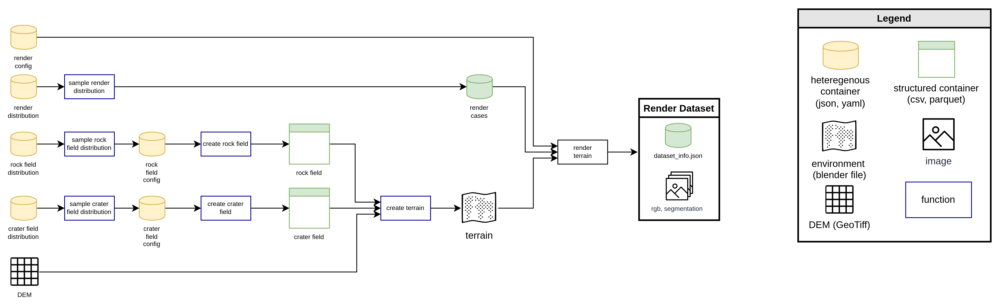

<h1 style="display: flex; align-items: center;">
  
 
</h1>

# Synthetic Generation of Lunar Terrain (LuNaSynth)

This project has tools to generate images of lunar terrain for navegation testing.

## Quick Start

- If you are using a dataset generated with Lunasynth, go to [dataset generation tutorial](src/tutorials/render_dataset_tutorial.ipynb) "Using the dataset". You can take a look at the [dataset analysis](test/dataset_analysis.ipynb) for examples of how to use the data.
- If you want to create renders, install the tools by following the instructions in [Install](#install-lunasynth-package) section, and run the [dataset generation tutorial](src/tutorials/render_dataset_tutorial.ipynb)
- If you want to contribute to Lunasynth development, read the Development section


## Overview 

Lunasynth gets a base Digital Elevation Map (DEM) from the Moon, adds rocks and craters, and renders the terrain from different perspectives. 



The objective of Lunasynth is to generate the detail from the maximum resolution of the input DEM (5mpix for the polar regions) up to the desired pixel size, which ranges from 1m to 1cm, depending on the application. 



Overview of lunar terrain image generation
- **Base Meshes**: The base meshes are the starting point for the terrain generation. They are used to create the terrain geometry.
- **Rock Field Distribution**: The rock field distribution is used to place rocks on the terrain. The rocks are placed on the terrain based on the CFA distribution
- **Crater Field Distribution**: Similar to rock field. For each crater, the mesh is modified based on the crater parametrization
- **Render Case**: the configuration of the camera and sun position for each render

## Install Lunasynth Package

Current system dependencies are:
- to use provided assets you need `git-lfs` (make sure to pull lfs objects with `git lfs pull` after cloning)
- to execute `gdal_create.sh` you need `gdal` and `imagemagick`

Execute `install_dependencies.sh` to install all system-wide dependencies. Currently only macos and debian-based distributions are supported.

Python dependencies are declared in `pyproject.toml`. Install them using
```bash
[lunasynth]$ python3 -m pip install -e .
```

If you use poetry (reconmmended for development), install all dependencies on its own virtual environment
```bash
[lunasynth]$ poetry install
```
Once you install the dependencies, append `poetry run` to any command to use the dependencies installed in the virtual environment. Alternatively, you can activate the virtual environment with 
```bash
[lunasynth]$ poetry shell
```

Check that the installation was successful by running the tests
```bash
(lunasynth) [lunasynth]$ pytest
```
It should report that all tests passed.


## Usage

To generate a dataset of lunar terrain renderings, use `generate_enhanced_moon_terrain_dataset.py` with a configuration file. For example, to generate the nominal orthographic dataset, run
```bash
(lunasynth) [lunasynth]$ python3 src/lunasynth/cli/generate_enhanced_moon_terrain_dataset.py --dataset-config config/datasets/ortho_nominal.yaml 
```
Follow the instructions in the [dataset generation tutorial](src/tutorials/render_dataset_tutorial.ipynb) for more details on how to define the configuration file and use the dataset.

Some steps are exposed as command line tools (CLI) scripts, see files in `src/lunasynth/cli/` for more details, and run them with `--help` to see the available options. Check tutorials in `src/tutorials/` for examples of how to use the tools.