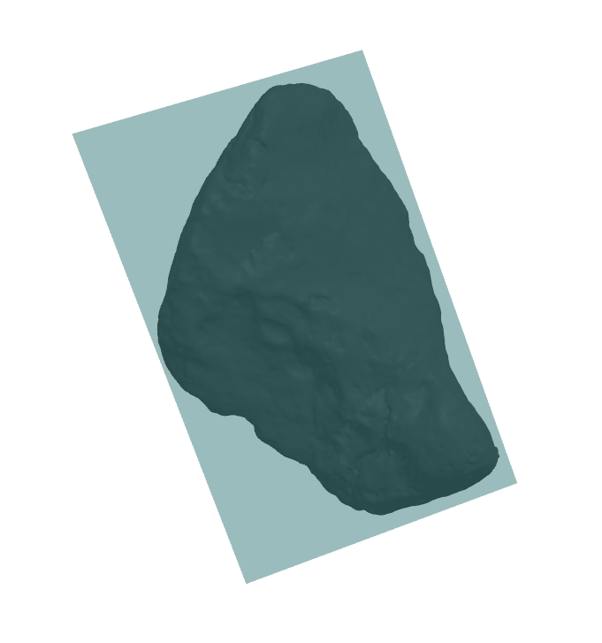

# Fix Asset Walkthrough

This document shows an example how to fix a mesh file. Initial rocks were too big, for example, `rock4.obj`, shows a max size of 2.89


It also showed it was not centered. To correct it, the script `scale_mesh.py` can scale, center, and rotate the meshes.





Running this command will scale, center, and rotate the mesh:

```bash
python src/data_tools/scale_mesh.py assets/rocks/*.obj --center --align --output-prefix ""
```

The output prefix `""` will overwrite the original files. The `--center` flag will center the mesh, the `--align` flag will align the mesh to the XY plane, and the `--scale` flag will scale the mesh to a maximum size of 1.0.

The output will be:


## Rock Format

Original rocks were in `.obj` format. Other formats are:
- `.obj`
- `.fbx`
- `.ply`
- `.stl`
- `.glb`
- `.gltf`: glTF format
- `.cae`: Collada format

Selection criteria:
- Easy to use: 
- Read by MeshLab
- Single file format
- File Size:
- ASCII/Binary

`.ply` format was selected. To convert the meshes to `.ply` format, run the following command:

```bash
python scripts/data_tools/convert_obj_ply assets/rocks/*.obj
```

### Renamm meshes 

To rename all meshes with the same pattern, run the following command:

```bash
ls | cat -n | while read n f; do mv "$f" "prefix_$n.${f##*.}"; done
```


### Full fixing pipeline

1. (if meshes are in blender) Export from blender to obj using [Batch Export Addon](https://github.com/mrtripie/Blender-Super-Batch-Export)
2. Run `scale_mesh.py` to scale, center, and align the meshes
3. Run `convert_mesh.py` to convert the meshes to the desired format
4. Rename all meshes with the same pattern.
5. Generate mesh table catalog with the new meshes.
