Moon DEM data sources:
- [Lunar Reconnaissance Orbiter (LRO) LOLA](https://astrogeology.usgs.gov/search/map/Moon/LRO/LOLA/Lunar_LRO_LrocKaguya_DEMmerge_60N60S_512ppd)
    - [DEM, 22GB](https://planetarymaps.usgs.gov/mosaic/LolaKaguya_Topo/Lunar_LRO_LOLAKaguya_Shade_60N60S_512ppd.tif)
    - [Relief, 11GB](https://planetarymaps.usgs.gov/mosaic/LolaKaguya_Topo/Lunar_LRO_LOLAKaguya_DEMmerge_60N60S_512ppd.tif)


### Chandrayaan-3

https://www.isro.gov.in/chandrayaan3_gallery.html


Apollo pictures sources:
- LPI , good metadata, [link](https://www.lpi.usra.edu/resources/apollo/)
- nasa history https://www.nasa.gov/history/alsj/picture.html

not all of them can be downloaded
 
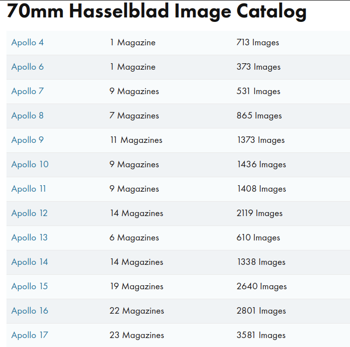


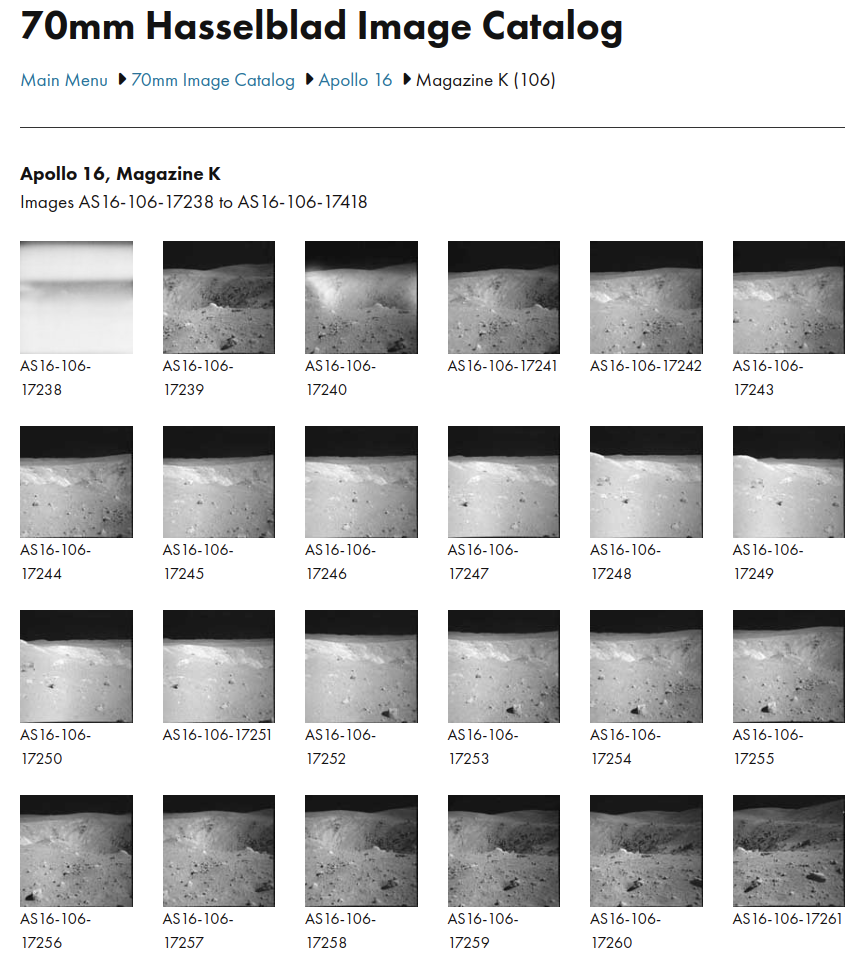

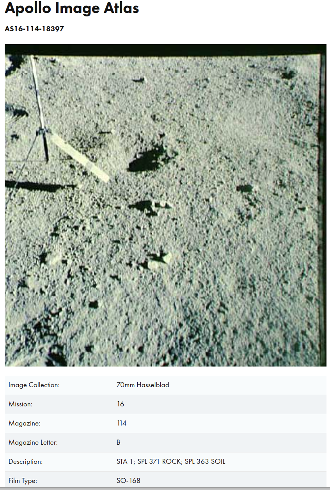
Example of bad quality picture


- tothemoon, high resolution scans: [link](https://tothemoon.ser.asu.edu/gallery/Apollo/17/Hasselblad%20500EL%20Data%20Camera%2070%20mm)

Is raw picture useful?
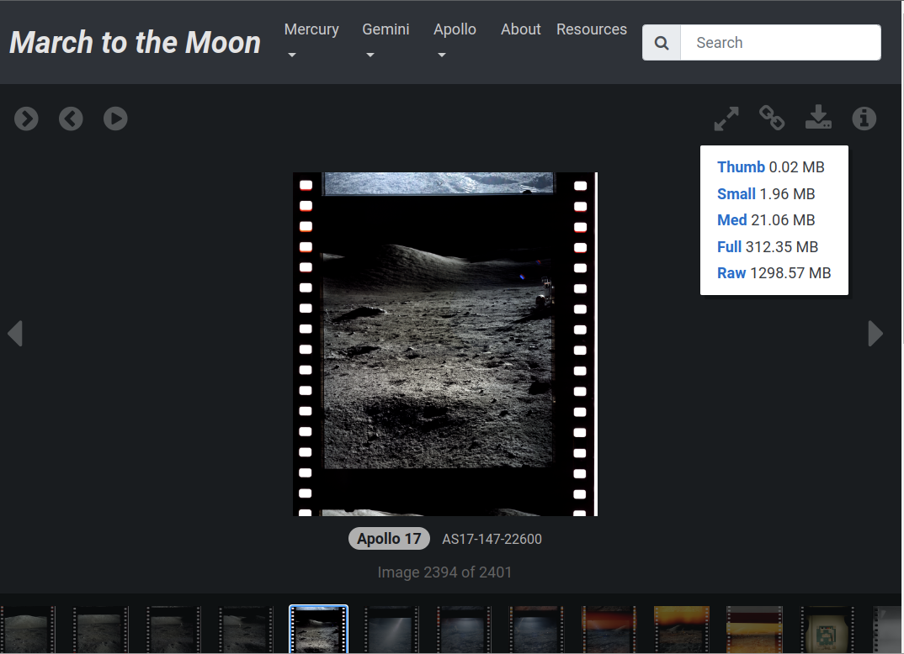

- Apollo archive, [link](http://apolloarchive.com/apollo_gallery.html)

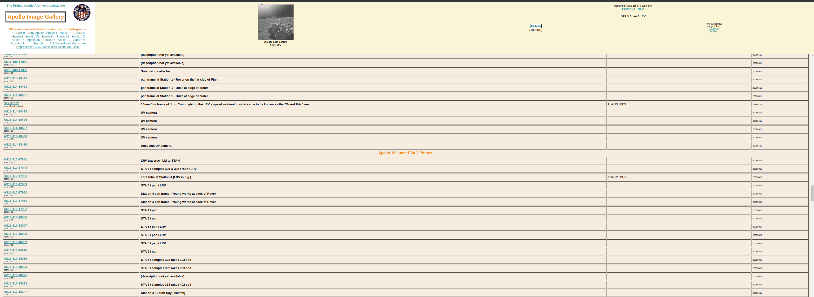

- Nasa pictures, good quality, with annotations, [link](https://www.nasa.gov/history/alsj/a16/images16.html#M117)

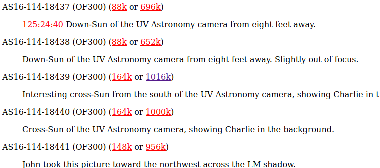

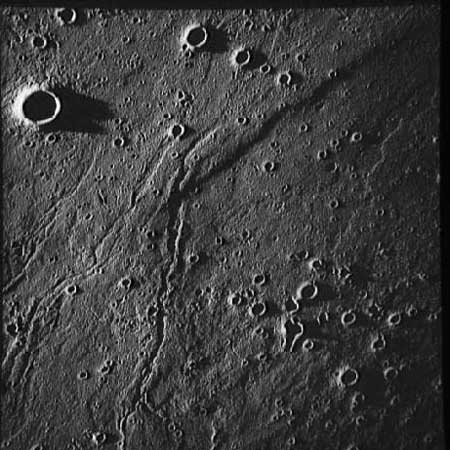
Orbital image with low sun angle of 1deg

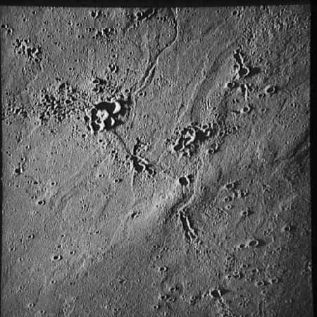
2deg sun angle


## Datasets

### Kaggle Moon Segmentation: [link](https://www.kaggle.com/datasets/romainpessia/artificial-lunar-rocky-landscape-dataset)

Tons of examples and masks for moon rocks. 4 years old, most approaches use U-Net.

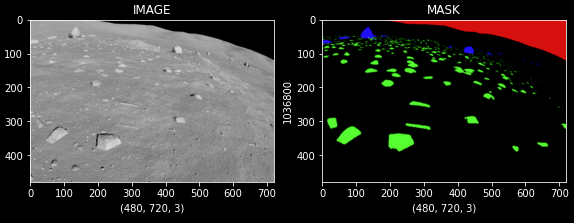

Moon metadata:
- location
- elevation
- time
- camera settings


Example of closeup 

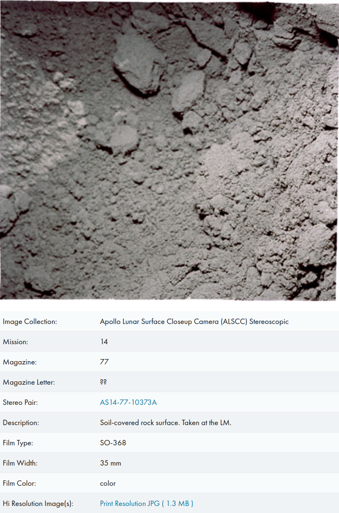


Rocks from Apollo 

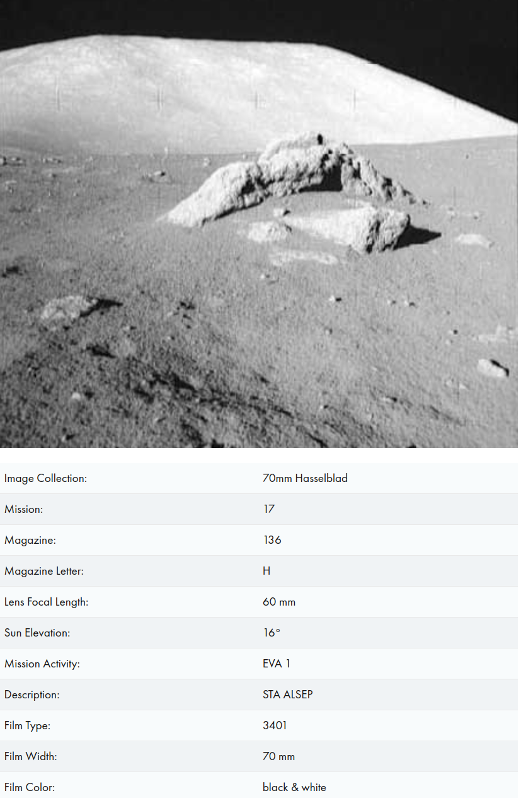


Chandraayan-3


## Direct photo generation

- [DeepMoon]()

LRO 1m DEM Shaded Relief


## Render Moon DEMs

- [STS-Vision Sim](https://github.jpl.nasa.gov/SRL-STS-Vision/STS-Vision-Sim)
- Latest georgio blender file
- Daniel Posadas' renderer
- [GUISS](https://github.com/nasa-jpl/guiss), 
- Digital Lunar Exploration Sites Unreal Simulation Tool (DUST)
[video](https://www.youtube.com/watch?v=VISq_V4W6LU&ab_channel=UnrealEngine), [paper](https://ieeexplore.ieee.org/document/10115607)


Moon Google Earth Equivalents:
- Quickmap
- Moontrek

1m/pixel

## LRO-LOLA DATA

https://pds.lroc.asu.edu/data/


Table PGDA Data Products
| Name |  Number | Resolution | Size | Source | Release Date |
|------| --------|------------|------|--------| --------------|
| [High-Resolution LOLA Topography for Lunar South Pole Sites](https://pgda.gsfc.nasa.gov/products/78) | 78 | 5m/pix | - | LRO-LOLA | |
| [LOLA MOON_PA gridded dataset](https://pgda.gsfc.nasa.gov/products/95) | 95 | 128 pixels per degree | 2.7GB | LRO-LOLA | | 
| [Large-scale Lunar Elevation Models to Support Optical Navigation](https://pgda.gsfc.nasa.gov/products/92) | 92 | 30m/pix | 1.1GB |  LRO-LOLA | |
| [A New View of the Lunar South Pole from LOLA](https://pgda.gsfc.nasa.gov/products/90) | 90  | 20-240m/pix  | 130MB-20GB | LOLA | 2023 |


Videos:
https://www.youtube.com/watch?v=ightLZL1L54&ab_channel=Verse


## Create dem products

Use script `gdal_create.sh` to create DEM products from PGDA data. The script will create a DEM product from a given input file. It will create a hillshade, a color relief, a slope map, and a combined hillshade with color relief. 


Use xargs to run gdal_create.sh on all files in a directory
```bash
ls -d "$PWD/../../moon_data/pgda/"*.tif | xargs -I{} bash gdal_create.sh {}
```
This images are used for the moon data catalog.


## Moon DEM Catalog

Create a table with a summary for each DEM. The table will contain the following columns:

Run with 
```bash
poetry run python src/data_tools/create_moon_dems_catalog.py
```

You might need to run an http server to see the local images. 

```bash
poetry run python src/data_tools/file_server.py --directory <path_to_DEM_folder>
``` 

## Chang'e-3 Data

http://moon.bao.ac.cn/ceweb/datasrv/dmsce1.jsp

A subset is available in the Kaggle dataset.