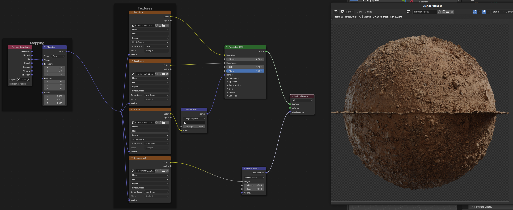

# Generate High Texture Rock Field

## 3D Assets
- https://polyhaven.com/: high quality PBR textures. All assets are free, paid addon. 
- https://www.poliigon.com/: good texture assets for blender. Some free, some paid
- https://blendermarket.com/: General Market for Blender assets
- https://quixel.com/megascans: High quality textures, paid, good Unreal Engine integration
- https://www.cgtrader.com/: focus on models, but also has textures
- https://www.turbosquid.com/Search/3D-Models/: only models, focus on quantity

Example of sources for rock meshes:
- [Free Rocks](https://www.cgtrader.com/free-3d-models/exterior/landscape/rock-pack-vol-1-3-free)
- [Turbo Squid](https://www.turbosquid.com/Search/3D-Models/free/rocks)

# Add high frequency noise to the mesh

2 main types:
- Add noise directly to the mesh
    - Generate the mesh in python
    - Using geometry nodes
- Add noise in the shader
    - Add noise texture
    - Use a scanned PBR texture

